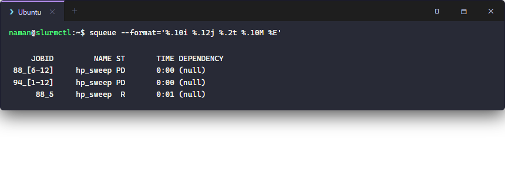
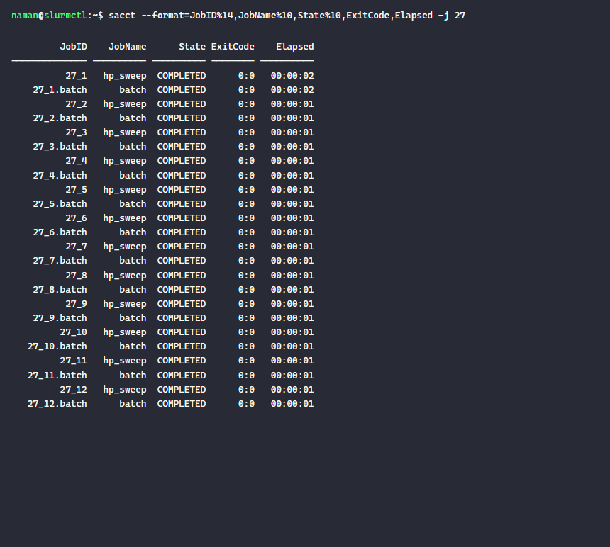
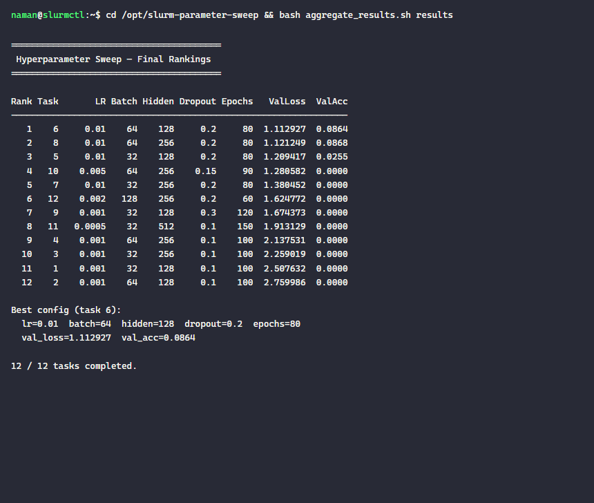

# slurm-parameter-sweep

A hyperparameter sweep over 12 configurations using a single Slurm job array. Each array task reads one row from a CSV file and runs an independent training simulation. Results are collected into a ranked leaderboard by an aggregation script.

This is the standard pattern for HPC-scale ML experiments, grid searches, and any workload where you need to run the same code with many different inputs.

## Structure

```
configs/
  sweep_params.csv        # 12 configurations (lr, batch, hidden, dropout, epochs)
sweep_job.sh              # Job array script - 1 task per config row
aggregate_results.sh      # Merges per-task CSVs into a ranked leaderboard
results/
  task_ARRAYID_TASK.out   # Per-task stdout
  result_N.csv            # Per-task result CSV (written by the job itself)
```

## Submitting the sweep

```bash
# Submit all 12 tasks as one array job
sbatch --chdir="$PWD" --export=ALL,SLURM_SUBMIT_DIR="$PWD" sweep_job.sh
```

Slurm assigns each task a unique index via `$SLURM_ARRAY_TASK_ID` (1–12). The script uses that to select the correct CSV row:

```bash
ROW=$(sed -n "$((SLURM_ARRAY_TASK_ID + 1))p" configs/sweep_params.csv)
LR=$(echo "$ROW" | cut -d, -f1)
```

### Job array in the queue



## Results

### sacct - all 12 tasks completed with exit code 0:0



### Ranked leaderboard



Best config found: **lr=0.01, batch=64, hidden=128, dropout=0.2, epochs=80**  
(val_loss=1.1129, val_acc=0.0864)

## Aggregating results

```bash
bash aggregate_results.sh results/
```

Each task writes `results/result_N.csv` independently. The aggregation script merges all CSVs and sorts by best validation loss. This pattern is robust: if some tasks fail, the aggregation simply reports how many completed.

## Controlling concurrency

By default Slurm runs as many tasks as there are idle slots. You can cap concurrency with `%N`:

```bash
#SBATCH --array=1-12%4   # run at most 4 tasks simultaneously
```

Useful when downstream resources (databases, API endpoints) have rate limits.

## Extending to larger sweeps

| Scale | Approach |
|---|---|
| ~100 configs | `--array=1-100` with a longer params CSV |
| ~1000 configs | `--array=1-1000%50` (cap at 50 concurrent) |
| Adaptive search | Submit small array → aggregate → submit next wave with promising regions |
| Random search | Generate `params.csv` with `numpy.random` before submitting |
